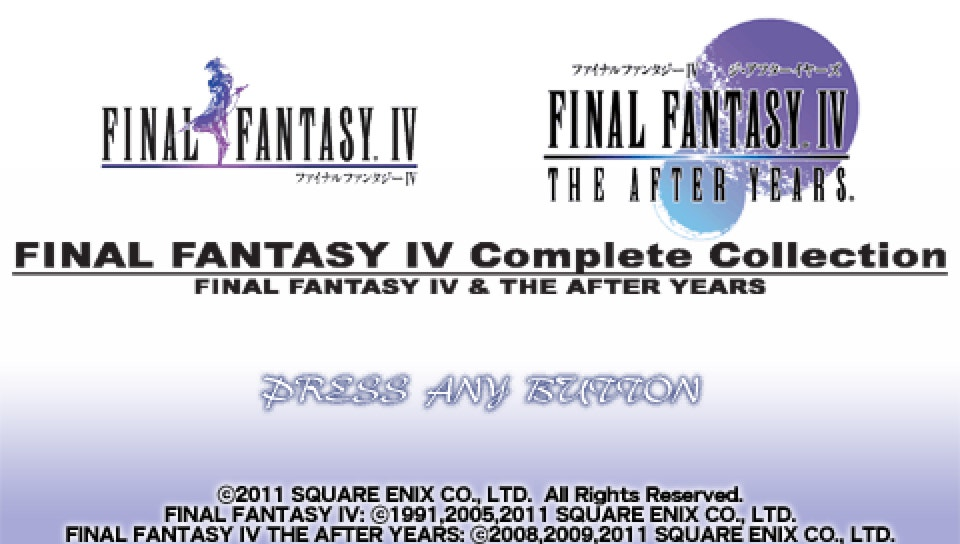
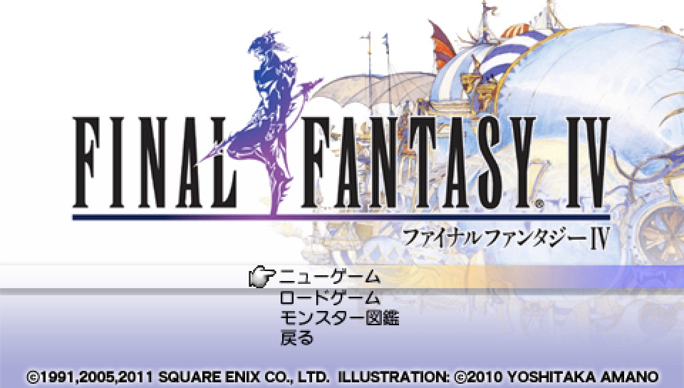

# FF4やるよ～

PSPのコンプリートエディションですよ
FFはPS版の7インターナショナルぐらいしかやったことがなくて、FF4の前知識は皆無なのでワクワクしますね
あれこれ書いてるとゲームが一向に進まなくなってしまうから、攻略上のメモを中心に程々に書いていきます

# FF4本編プレイ記

## オープニング
主人公のセシルくんはバロン城にお仕えする暗黒騎士で、赤い翼という飛空艇部隊の隊長を務めていました。だけど最近は王様の様子がおかしくて無茶苦茶をやらされてブルー、というところからお話は始まります。

セシルくんは王様に何やってんのと問いただすとご機嫌を損ねて部隊長をクビにされてしまい、ミストの村というところにボムの指輪を届けてこいやとお使いを命じられます。FFでボムというとあのモンスターだよね
以前はこんな耄碌じゃなかったらしい王様、モンスターに乗っ取られてるパターンね。で側近が怪しいやつね

動けるようになったらお城を探検

## バロン城
### メモ

- バロンに伝わる宝物があるらしいけど今は兵士が壁のスイッチの前を通せんぼしていて取れない

セシルの技は「あんこく」って暗黒騎士だからってストレートすぎるネーミング、名前からどんな技かもわからないし。あえて技の内容がわからない得体のしれない名前にして暗黒騎士っぽさを出していくスタイルかな。

ツボや木箱を見るやいなや、近づいて決定ボタンを押さずにいられない病にかかってるんですが、FF4は宝箱以外からもアイテムが出るRPGなのかどうか

壁のスイッチを押して、遠足のおやつのアイテムを回収
たぶんヒロインっぽいローザと、FFシリーズの他の作品でも名前を見たシドが登場。シドはFFの名物キャラみたいで。飛空艇なんかのメカの技師みたいなキャラなのはどの作品でも共通なのかな

北西の塔にある自分の部屋に戻って寝よう
ミストの村へのお使いにはカインが同行してくれます

ワールドマップに出たらバロン城のお膝元のバロンの町へ

ワールドマップではダッシュはできないようです
ワールドマップは今どきのRPGでは珍しくなってしまいましたね。個人的にはワールドマップはあったほうが冒険の雰囲気や世界の広さをより感じられて俄然RPGやってる感が高まります

## バロンの町
### メモ

- 宿屋の入れない部屋に鍵のかかった宝箱がある
- 街の西の建物のカギがかかっている扉はお城に通じる地下水路への入口とのこと

ワールドマップに町のシンボルが左右に二つあるけどどちらに入っても一緒

ツボを調べると【ポーション】を入手！ツボからアイテムが出るRPGでした　ツボはくまなく調べて回らないと～
井戸も怪しいよね、地下通路の入口になってるのがありがちですし。今のところ何もないようですが

それにしてもこんな特撮の怪人みたいな格好で街をウロウロしてツボとか調べて回ってるの怪しすぎ～、とか思ってたら、町の女の子になんでそんな格好してるのかと早速ツッコミを入れられるし

ローザとシドの家がありました
ミシディアへと通じるデビルロードはたぶんワープポイントと思いますけれど悪魔の道だなんて、物騒な曰く有りげな名前。今は向こう側から封じられていて使えないようです。
デビルロードがある建物の地下のトレーニングルームではチュートリアルを読めるのと、ネミングウェイという人？に話しかけるとキャラの名前を変えられます。セシルの名前をいつもの「ヨウマ」に変更。

チュートリアルの内容をメモしておこ

- 戦闘中にLR同時押しで逃げられる。逃げる方法を真っ先に伝えてくるということは、急に強い敵が出てくることがあるのかな。古いRPGだし橋を越えると強いモンスターが出てくるとかありそうですしね。戦闘の難易度がそもそも高いのかもだけどですけど
- 魔法は全体にかけられるものがあり、戦闘中に十字ボタンかアナログスティックの左で敵に、右で味方全員にかけられる。メニューで使うときも同様とのこと。「ぜんたいか」ってやつですね
- 持ちきれないアイテムはチョコボの森のでぶチョコボに預けられる。でぶチョコボはチョコボ臭いところでギサールの野菜を使うと呼び出せるみたいですね
- HPが低い人は後列に下げる。戦闘中にコマンドを選ぶ時右を押すと隊列の変更と防御ができる
- 戦闘中にアイテムとして使える武器がある。使うには装備する必要があるのかな。戦闘中に装備を変えられるのね。……つまり戦闘中に装備を変えて対応しないといけない敵がいるってことかも？矢の補充という言葉も出てきます。使うのに消費アイテムがいる武器もあるようで
- ATBならではの戦闘のリアルタイム要素の解説も。忙しないのは好きじゃないというか焦らされると頭が爆発するので私は今のところはウェイトで遊びます
- 洞窟の中にもセーブできる場所がある。ワールドマップではどこでもセーブでダンジョン内ではセーブポイントでセーブする方式ですね。よくあるやつ。

町の北の話しかけるとダンスを披露してくれる踊り子がいる場所の奥で川に…入れる！？町の中で川に入れるなんて珍しくない？その先の行き止まりでテントを発見

武器屋と防具屋を覗いこうかと思ったら鍵がかかっていて入れない
なけなしのお小遣いは道具屋で店内にいた踊り子の、ポーション、毒消し、テントをお忘れなく！という助言に従ってそれらに使いました。戦闘不能から復活するフェニックスの尾が100ギルとリーズナブルだけどこんなもんだっけ。戦闘不能になりやすいバランスだったりする？

バロンの北西にあるミスト洞窟に出かけます

## ミストの洞窟

奥へ進むと聞こえてくる、立ち去りなさいという忠告の声は道を引き返しても聞こえてくる
出口の近くで声の主のミストドラゴンとボス戦に。しばらくするとミストドラゴンが霧になり、霧になっている間は攻撃すると反撃されるので防御して元に戻るのを待ちます。
倒したらいけない感じがしますが倒すしかないようなので、ボコボコにしたら洞窟を抜けてミストの村へ。

## ミストの村

村に到着するとお届け物のボムの指輪の力が発動して村は火の海、やっぱり仕組んでいやがったな、勝手に発動するとか危なすぎ～　それとも目的地に着くと自動発動するよう仕掛けてあった？使うと魔法が発動する指輪アイテムとかもあるのかな

ミストドラゴンは実は召喚獣で、えーっと召喚獣が死ぬと召喚士も一蓮托生で心中する設定でいいんでしょか。ミストドラゴンも後々セシル一行でも召喚できるようになったりする？

セシルたちが殺害しちゃったミストドラゴンの飼い主の娘さんの女の子とイベント戦闘になりますがほどなくして女の子が召喚してきた赤鬼みたいなマッチョおじさんが地震を使って戦闘は終了、地震を使ってくるということはタイタンなのかな

会話の間が意味深なカインとは別れてワールドマップに追い出され、来た道は塞がれて戻れなくなるので先へ進んで、砂漠の真ん中にあるオアシスのそばの村に入ります。

## オアシスの村　カイポ

### メモ

- 砂漠の名前はダムシアン砂漠という
- カイポの北にダムシアンという国の城がある
- ダムシアンの東のファブールへ続く地下水脈に変なじいさんがいて通せんぼしてる
- ダムシアンの東のアントリオンの洞窟は王族しか行けない
- 地下水脈は北東にある

バロンの兵士がミストの村の女の子を狙って夜這いにやってきましたがただの烏合の衆、その辺のザコモンスターよりダメージ食らってるし。鍛錬が足りないのか装備がポンコツなのか

ここでミストの村で出会った女の子の召喚士リディアが加入！
リディアはレベル1なのでレベルが上がるまでは倒されないように注意しよう
あれ、さっきの赤マッチョおじさんは呼び出せないの？
新しい仲間リディアが加入した先で名前変更担当のネミングウェイが偶然にも訪れてるんだけど、もちろん偶然ですよね…まさか後をつけられてる…？

お店にたいしたものは売ってないけれど武器屋に弓と矢が売ってたので買ってみる

この村にも北にダンスを披露してくれる踊り子がいますね

村の北東の民家にバロンから逃げてきたらしいローザがいて、ローザは高熱病という病に臥せっており治すにはさばくの光という物が必要でそれはアントリオンの洞窟にあるようです。なんでそんなレアアイテムぽいのがいるの、病気の薬が高嶺の花なのはお約束だね
次の目的地はそのアントリオンの洞窟で良いのかな？だけど王族しか入れないそうだし、ダムシアンに行って王様に会う必要がありそうなのでまずは、ダムシアンに続くという地下水脈へ行けば良さそうです

地下水脈に行く前に、リディアのレベルを少し上げて宿屋に泊まりMPを回復しておきました
リディアは召喚魔法だけじゃなく白魔法や黒魔法も使えるので頼もしそう
サイトロって聞いたことがなかった魔法だけどミニマップを見る魔法ですか。ミニマップが魔法になってるなんてあまりというか他に見たことないかも

戦闘中に技やアイテムの説明を見るには…あ、Lボタンで出てきた。さすがに見られますよね～状態異常の種類が多くて治すアイテムもいくつもあるのに効果が見られないと覚えるのが大変だし。どれがどれを治すやつだっけ～って記憶力が乏しい私は途方に暮れます

隊形はパーティの上から順に前と後で交互に並んで、チェンジで前後が入れ替わるんだ、把握しました
全員が前列とか、この人は前でこの人は後で～という風に個別に配置はできない仕様かな

隊列は初期状態だとセシルが上から3番目の真ん中になってるけれど、上にいるキャラは狙われやすいとかあったりして…一応並べ替えておこう、と思って並べ替えたら移動画面のキャラがセシルじゃなくなったんだけど
パーティの真ん中にいるキャラが表示される仕様なんですね。移動画面のキャラが固定じゃなくて変えられるのは楽しいね。ということは前と後ろ以外には狙われやすさに違いはなさそうかな

## 地下水脈

### メモ

- B2Fの画面右に見える宝箱は現時点では取れない？

黒魔法を敵全体にかければ一網打尽、水系っぽいモンスターにはサンダーでいいんだっけ…でもあまり効かないのもいるなぁ。カエルにはブリザドが効く
取扱説明書すら見ない前知識皆無の完全初見で遊んでいて敵の弱点属性の知識も全くない手探りのプレイなんですよね。試しながら覚えていこ

全体化しても消費MPは変わらないから、属性を吸収して回復するやつ、そういうのたぶんいますよね？それがいないぶんには基本は全体化がいいのかな。単体攻撃はダメージが高いようだから優先して倒したい敵がいるなら使うようにしようか

ゾンビーが出現してそうそうアンデッドにはケアルでダメージを与えられるんですよねーと試してみると微々たるダメージだった～

道を塞いでる変なじいさんというのはカイポで名前を聞いた賢者テラで、吟遊詩人と駆け落ちしてダムシアンに行った娘さんのアンナが心配なので自分もダムシアンに行きたいけど、8本足の魔物に足止めを食らってるから倒すために手を貸してほしいと頼まれてパーティに加わります。あら仲間キャラなんですか。テラはレベルが20と高くて一時加入キャラの香り。アスピルでMP回復できるから長丁場でも頼もしそう

南口にある大きな滝は登れるのかな？と正面から進んでみると隠し部屋を発見！滝の裏になにかあるのは基本ですね

セーブポイントがある部屋ではテントも使えるようです。テントはダンジョン内でも使えるのね

ところでセシルのあんこくなんだけど、使用にHPを消費するという自分の身を削って繰り出す技なのに、よわ～　全体攻撃なのはいいんだけどダメージが通常攻撃の半分以下

レッドマシュマロとかいう梅干しの化け物は通常攻撃が通らないようで、色に反してファイアが効く

ダイエットフードってどんなアイテムかと思ったら「ブタ」を治す、って。カエルにされる状態異常があるのは知ってたけどがブタにされるのもあるなんて、FFって状態異常で個性を発揮してますね

先頭が終わって歩き出した途端にまたエンカウントすることもあるけれど、この歩数歩くまではエンカウントしないよ、という仕様はなさそう？

パーティの真ん中の、移動画面に表示されるキャラがカエルにされたまま戦闘終了すると、移動画面のキャラもカエルになって笑った。手が込んでますね。

と言うか敵が結構強めじゃないかな？先手を打って攻撃してるうちは押し切れるけど1人が麻痺させられたりするとわりとピンチ
サハギンたちから1人が集中攻撃を食らって倒されたけど現在HPが低い敵を狙うルーチンなのかな

地下水脈を抜けると一旦ワールドマップに出るのでテラが言う通りテントで一泊したら、続いて地下に通じる滝へ。

### 地下に通じる滝

ちょっと進むと滝にダイブ！さっそくボス戦かなと思ったらもうちょっと進んだ先だった
8本足の魔物こと巨大タコのオクトマンモス、タコといえばFFにクラーケンっていたはずだけど彼との関係は…なさそう？8本の足というからそれぞれの足が別々に行動してくる本体と取り巻き型のボスかと思ったら、HPの減りに合わせて足のグラフィックが減っていくボスだった。足が減るのは見た目だけで行動パターンが変化したりはしないみたい？
テラが協力を頼んできただけあってセシルの通常攻撃で大ダメージ、魔法はファイアやブリザドはダメージ1でサンダーはそこそこ通る程度
HPを減らすとテラのさすが暗黒剣の使い手云々のセリフが出たから、あんこくならもっとよく効くのかと思ったら別にそんなことはなかった　魔法の全体化のようなターゲットが多いほどダメージが減る仕様でもなく素の威力でこれなんだ…

オクトマンモスを倒してワールドマップに出ると、すぐ北に見えるお城がダムシアンですね
しかしダムシアンに近づくと、待ってましたとばかりにたぶんバロンの飛空艇団が現れてダムシアンを空爆して去っていきました。あらあら、テラの娘さんのアンナは無事かな？行ってみよう

### ダムシアン城

入ってみるとお城は空爆で廃墟と化し、ダムシアンの兵士たちはなすすべなく倒されたようです。FFには死体を調べた時に「へんじがない　ただのしかばねのようだ」といった独特のセリフはない模様？

飛空艇団はやはりバロンの赤い翼で、バロンはクリスタルを集めておりダムシアンにもあったクリスタルを強奪していった模様。空爆しただけに見えたんですがいつの間にクリスタルを奪ったの
赤い翼は、ゴルベーザという、聞いたことある名前だー　その人がセシルの後釜になって率いているようです

ところでクリスタルってなんだっけ。ほんとに前知識が全く無くて。そういえばクリスタルがどんなものかまだ説明がなかったような。よくわからないけどRPGあるあるなそれぞれの属性のエネルギーが凝縮された宝石みたいなやつという認識でいいのかな

ダムシアン城の最上階では倒れているアンナとそこに駆け落ち相手の吟遊詩人が登場し、テラは彼がアンナをやったと勘違いしてイベント戦闘発生、早とちりすんなじいさん。ストーリーに会話付きのイベント戦闘がよく挟まれてますね

さてアンナは残念ながらここで退場、イベントで亡くなったのは回復魔法やアイテムで復活はダメなんですよねやっぱり。FFのどれかはわからなかったけれど初期の作品で、ストーリー中にアイテムを使って蘇生しようとするシーンがあったような覚えが

テラはアンナの仇のゴルベーザを倒すといって1人で行ってしまいました。おいおい無茶すんなじいさん。
そういえば離脱したキャラは装備を置いていってはくれないようです。今後重要なアクセサリーとか持ってかれると困るなぁ

吟遊詩人の正体はダムシアンの王子ギルバートで、さばくの光を手に入れるには王族である彼の協力がいるということでパーティに加わってもらうことに

さばくの光があるアントリオンの洞窟へ行くには浅瀬を渡る必要があり、浅瀬を越えられるダムシアンのホバー船を入手。初の乗り物ゲット！